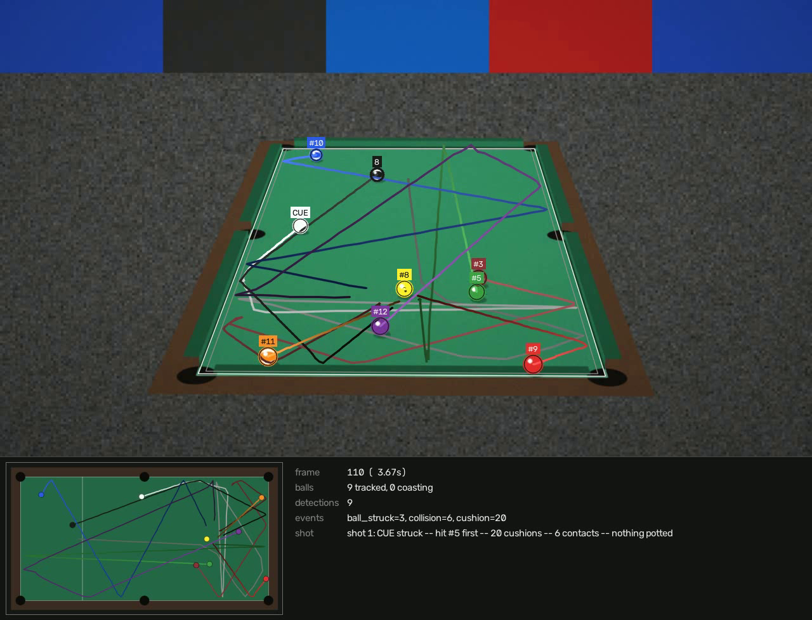

# Billiard Ball Tracking

Tracks every ball on a pool table through a video — trajectories, collisions,
cushion contacts and pots — **without tuning colour thresholds for each clip**.

The cloth colour is measured from the video, the table is found and rectified,
and from then on every threshold in the pipeline is expressed in inches rather
than pixels. That is what makes it work on a new clip without being re-tuned.



*Nine balls tracked through a break, filmed the way a broadcast is: from behind
an end rail, through a real pinhole camera. Per-ball trajectories, the shot so
far (20 cushion contacts), and a top-down diagram drawn from the tracker's own
table coordinates. The clip is the built-in physics simulator, so every
position, speed and event here is checkable against ground truth.*

> Originally a final project for ENG 301 – Computer Vision at Fulbright
> University Vietnam, Spring 2024. Rewritten since; see
> [`UPGRADE_NOTES.md`](UPGRADE_NOTES.md) for what changed and why,
> [`DIARY.md`](DIARY.md) for how it got there day by day, and
> [`legacy/`](legacy/) for the original code. The original's table-warp
> helpers began as Stuart Grieve's 2015 *PoolTable* project; see
> [`legacy/README.md`](legacy/README.md).

---

## Install

```bash
pip install -r requirements.txt
```

Python 3.9+. Only NumPy and OpenCV are required; SciPy and PyYAML are optional
(an exact pure-NumPy assignment solver and JSON config ship as fallbacks),
`imageio-ffmpeg` lets the app write videos every browser plays, and `yt-dlp`
lets it track a YouTube link.

## The app

```bash
python main.py                            # opens http://127.0.0.1:8765/ in the browser
python main.py app --port 9000            # the same, with options
python main.py app --folder D:/footage     # list the videos in another folder too
```

Everything the command line does, in a browser tab, plus live tracking. It
opens on the **Library**, which says at the top what to do next: add a video,
track it, see the results.


* **Library**: the videos in the current folder (and any folder you add, or
  files you drop onto the page), each with its thumbnail and last result. Each
  has one blue button for its next step: **Track**, then **Watch progress**
  while it runs, then **See results**. Clicking the picture does the same.
  **Add videos** takes a YouTube link, uploads files, or lists a whole folder.
* **A YouTube link**: paste it in *Add videos*. The app looks it up in a few
  seconds and shows its length, and how long tracking it all would take on
  this computer. You then pick the part you want (`20:00` to `25:00`). Only that
  part is downloaded, at 720p, and it is tracked as soon as it arrives. The
  estimate for your part updates as you type. On the work laptop a 60 fps
  broadcast tracks at a little over half its playing speed, so a whole
  hour-long match would take about 1 h 45 min, and a 3–5 minute part 5–8
  minutes. A link made with
  YouTube's *Share → Start at* fills in the start. Any site `yt-dlp` reads
  works too.

  

* **Set up** (*Check the table first* / *Change set-up*): where the tracker
  thinks the table is, drawn over any frame you pick, with the balls it sees
  there and plain warnings when something looks off. The cloth mask shows what
  was taken for cloth. If the outline is wrong, **place the corners by hand**
  by dragging them. Table size, ball set, balls in play and the part of the
  video to track are set here, per video, and kept.
* Tracking carries on in the background, one video after another. While it
  runs you watch the frames as they are tracked.
* **Results**: the tracked video beside a top-down view of the table that
  follows it frame by frame. A timeline marks every shot, contact, cushion and
  pot; click one to jump there. There are lists of shots, events and balls, a
  speed chart for the ball you pick, and a **Download** menu (the video, a CSV
  of every ball in every frame, a JSON of shots and events). Keys: `space`,
  `←`/`→` (a frame), `[`/`]` (an event). *Link to this moment* copies an
  address that opens the results at that frame. Everything tracked is listed
  under **Results** in the sidebar.
* **Live**: a webcam or USB camera, a network stream (RTSP, MJPEG, a phone
  camera app), or a library video replayed at its own pace. The table is found
  from the first second or so. Frames the tracker has no time for are skipped
  rather than falling behind, and the session can be kept in Results.

It listens on this computer only, keeps everything in `billiards-workspace/`,
and needs nothing beyond the requirements above.

## Use

```bash
# Watch it work
python main.py clip.mp4 --show

# Save an annotated video plus data
python main.py clip.mp4 -o out.mp4 --csv tracks.csv --json run.json

# Check the calibration before a long run — this answers most questions
python main.py calibrate clip.mp4 --save-preview calib.png

# A different table
python main.py clip.mp4 --preset snooker-12ft

# A part of a YouTube video: only 20:00-25:00 is downloaded (into
# billiards-workspace/downloads/, where the app lists it), then tracked
python main.py "https://www.youtube.com/watch?v=d5TyZPetBkA" --start 20:00 --end 25:00 -o out.mp4
```

While a window is open: `space` pauses, `c` clears the trails, `q` quits.

### Outputs

* **Annotated video** — balls circled in their own colour with stable IDs,
  trajectories and contact points, with the top-down diagram and the live read
  in a bar *below* the picture rather than over it: a pool camera fills its
  frame with table, so an inset in any corner covers the thing you are trying
  to look at. A ball the tracker is *predicting* rather than *seeing* is drawn
  dashed. `--overhead-inset` puts the diagram back in the corner and keeps the
  source resolution; `--no-overhead` drops it altogether.
* **`--csv`** — one row per ball per frame: position in table inches and in
  image pixels, velocity, speed, track state.
* **`--json`** — calibration report, run statistics, the full event log
  (collisions with closing speed, cushion contacts, pots, balls struck) and a
  **shot log**: the raw events grouped into shots, the way a player reads them.

```
[billiards] 2 shot(s):
[billiards]   shot 1: CUE struck -- hit #4 first -- 1 cushion -- 3 contacts -- nothing potted -- 2.1s
[billiards]   shot 2: CUE struck -- 2 cushions -- potted #3 -- 5.4s
```

(That is `albin_fedor.mp4`. `#` numbers are the tracker's ids, not the numbers
printed on the balls.)

A shot opens when a ball goes from rest to struck and closes once every ball has
settled — the same definition a referee uses — so it needs no timer or threshold
of its own.

### Options worth knowing

| Flag | Meaning |
|---|---|
| `--preset` | `pool-9ft` (default), `pool-8ft`, `pool-7ft`, `snooker-12ft`, `carom-10ft` |
| `--start` / `--end` | Process a time range, in seconds |
| `--table-corners x1,y1,...` | Override the automatic table fit |
| `--max-width` | Downscale for speed; accuracy is scale-invariant |
| `--debug` | Also show the detection mask |
| `--no-overhead` | Drop the top-down diagram |
| `--overhead-inset` | Diagram in a corner of the picture, not in a bar below it |

Full configuration: `python main.py dump-config config.yaml`, edit, then
`--config config.yaml`. Every value is in inches, seconds or a ratio — never
pixels.

## How it works

```
frame ──► cloth mask ──► "on the bed but not cloth" ──► size/shape gates ──► detections
              ▲                                              ▲
     measured from 25 frames                    expected ball size, from the
     sampled across the clip                    homography, at that image point

detections ──► Hungarian assignment (distance + colour) ──► Kalman filter per ball
                                                            (table inches, with
                                                             rolling friction)
                    │
                    └──► collisions · cushions · pots · shot starts
```

1. **Calibrate.** Measure the cloth colour robustly across the clip, then
   re-measure inside the region that selects (otherwise a background sharing the
   cloth's hue widens the window until it accepts everything). Fit the four
   cushions as lines and intersect them for the corners, since pockets eat the
   actual corners. Decide which way round the table is by which assignment a
   real camera could have produced — filmed down its length, a pool table's
   100-inch side covers *fewer* pixels than its 50-inch one.
2. **Detect.** Anything on the bed that is not cloth. Pockets are excluded
   geometrically. Ball size comes from the homography and is computed for a
   **sphere**, which is not foreshortened the way a painted disc is. Touching
   balls are separated by distance-transform peaks plus radial-symmetry voting
   on the colour gradient, which is what lets a racked cluster be resolved.
3. **Track.** One Kalman filter per ball in table coordinates, with rolling
   friction and process noise that loosens the moment something unexpected
   happens; globally optimal assignment on position *and* colour; coasting
   through occlusions instead of dying.
4. **Analyse.** Events come from the balls' *raw* paths, not the filter, which
   turns a corner over two or three frames:
   - **A cushion** is motion toward a rail turning into motion away, within
     reach of it and with no other ball nearby.
   - **A collision** is two paths turning a corner together, a ball's width
     apart, or two balls passing within 1.25 diameters during a frame while
     closing.
   - **Pots** wait to see whether the ball comes back.

   Then everything is grouped into shots by ball motion.
5. **Survive the cut.** Broadcasts change angle mid-clip. When the bed stops
   looking like cloth, tracking pauses rather than reporting balls in the crowd,
   and the table is re-found from several agreeing frames.
6. **Use the scene's clock, not the file's.** A screen-recorded broadcast holds
   25-30 fps content in a 37.5 fps file, so frames repeat and the gaps between
   new ones say nothing about the time between them. Copies are replayed rather
   than measured, and the moving balls themselves decide how much time passed:
   one source frame, or two where the recorder missed one.
7. **Place a ball by its centre.** A ball's centre is a radius above the cloth,
   and projecting its image onto the cloth puts it 2-4 in too far from the
   camera on a broadcast angle. The camera is recovered from the table's own
   geometry, and balls are placed through the plane at ball-centre height.
8. **A ball that comes back is the same ball.** A ball lost in the pocket
   jaws, or behind the player, keeps its identity if it reappears.

## Accuracy

Measured against a physically simulated break with exact ground truth. It's
filmed through a pinhole camera behind an end rail, on the sample broadcasts'
blue-grey cloth with their ball colours, and scored on balls at least half in
view (`reports/run-log.json`, 26 Sep 2026):

| | Constant-rate clip | Screen-recorded broadcast style* |
|---|---|---|
| MOTA | **0.844** | **0.816** |
| Precision / recall | **1.000** / 0.846 | **0.994** / 0.822 |
| Median position error | **0.30 in** | **0.21 in** (ball radius is 1.125 in) |
| Median speed error | **2.7%** | **4.9%** |
| Cushion contacts found | **20 of 23**, 0 false | **15 of 21**, 0 false |
| Collisions found† | 4 of 6, 3 false | 2 of 5, 3 false |

\* 25 fps content captured at 37.5 fps, frames arriving late and one in eight
missed. † Excluding contacts inside a static rack, which no camera can see.

Most of the misses are one ball: the blue stripe, whose colour the blue-grey
cloth mask partly takes for cloth. On green cloth the break scores 0.87 against
0.81 on blue-grey (below). Before 23 Sep the simulator used generic ball
colours on green, and this table read 0.92.

### Other footage

The sample clips are one venue, one camera and one cloth.
`tools/robustness.py` renders the same break under the conditions other
footage brings, tracks each with default settings and scores it against
ground truth (4 s of play each, so a little lower than the table above):

| Footage | MOTA |
|---|---|
| Blue-grey cloth, end camera, 720p, 30 fps (the sample clips' conditions) | 0.81 |
| Green / tournament-blue / burgundy / camel cloth | 0.87 / 0.87 / 0.86 / 0.74 |
| Grey cloth | 0.79 |
| The sample clips' cloth on a royal-blue floor (the 2026 US Open) / green cloth on a red floor | 0.81 / 0.86 |
| Camera across from a long rail / on the ceiling | 0.72 / 0.88 |
| Tripod at a corner, table small in the picture | 0.57 |
| 854×480 / 1920×1080 | 0.77 / 0.79 |
| Filmed at 60 fps / screen-recorded broadcast | 0.80 / 0.80 |
| The broadcasts' ball set | 0.82 |
| Edited like a broadcast: cut away mid-shot, back on a camera across the table, cut again, back (8 s) | 0.78 |

```bash
python tools/robustness.py    # writes reports/robustness.json and results/robustness.png
```

A simulator only varies what it was built to vary: until 28 Sep its table
always stood on grey carpet, and the first clip from another event, the 2026
US Open, tracked nothing (its royal-blue floor was taken for the cloth).
`tools/venues.py` tracks one real minute from each of 11 venues: the sample
clips' event, the WPA final, the US Open, Mosconi Cup, Premier League Pool,
UK Open, Hanoi Open, a heyball final, an old Derby City Classic match, an
amateur bar-box game and snooker. There is no ground truth, so it reports
whether the table was found and how, and what was counted, with one frame of
each in `results/venues.png`. The table is found at all 11.

```bash
python tools/venues.py        # downloads the minutes once, into .cache/venues/
```

Per-variant recall, position and speed error, ball numbers and events are in
[`UPGRADE_NOTES.md` §12.4](UPGRADE_NOTES.md#124-footage-unlike-the-sample-clips--toolsrobustnesspy).

Speed on the 1080p sample clips, processed at 1280 px wide: 26-27 fps writing the annotated video, 60-80 fps without it.

Reproduce it:

```bash
python tools/make_synthetic_clip.py --out out/break.mp4 --ground-truth out/gt.csv
python main.py track out/break.mp4 --csv out/tracks.csv
python tools/evaluate.py --gt out/gt.csv --tracks out/tracks.csv
```

## Library use

```python
from billiards import Config, RunOptions, run

summary = run(Config(), RunOptions(video="clip.mp4", output="out.mp4"))
print(summary["events"])
```

Or drive it frame by frame with `billiards.pipeline.build_pipeline` and
`TrackingPipeline.process`.

## Tests

```bash
pip install -r requirements-dev.txt
pytest -q                  # all 131
pytest -q -m "not slow"    # unit tests only
```

`tools/evaluate.py` scores accuracy against the synthetic clip. The real clips
have no ground truth, so how *noisy* their output is — phantom tracks, speed
estimates that swing between frames, positions that jitter while nothing moves,
events for things that did not happen — is measured separately, by
self-consistency against physics:

```bash
python tools/run_report.py --ground-truth --note "what I changed"
python tools/run_report.py --show
```

Each run appends an entry to [`reports/run-log.json`](reports/run-log.json)
with the commit, the numbers for every clip and what it did *not* fix, so the
state of the work is on disk rather than in someone's head — and it rewrites
`results/` (annotated video, CSV, run JSON and calibration preview per clip),
because a number says whether something improved and only the video says
whether it looks right. `--no-render` skips that when you only want numbers.

## Limitations

- **A static rack** resolves to roughly 6 of 8 balls: adjacent balls of
  similar colour share no visible edge, and from an end rail they hide each
  other.
- **A ball against the far cushion** appears past the edge of the region
  searched, so it isn't seen there, although its bounce is still found from
  the path either side. A pot into a far corner can be missed the same way
  (`albin_fedor`'s 5). The app's *Look for balls against the far cushion*
  (`detector.search_raised_bed`) finds them, but can also take a black ball's
  shadow or a hand on the rail for a ball, so it is off by default.
- **Broadcasts and other venues** (`tools/venues.py`, below): the table is
  found at all 11 venues tried, and a ball keeps its id across a camera cut
  (see `UPGRADE_NOTES.md` §15). A broadcast minute still lists 3–4 times more
  balls than the table has: hands on the rail, shadows, and balls that moved
  too far while the camera was away. Replays are tracked as if they were
  play.
- **A camera at a corner of the table**, with the table small in the picture,
  tracks worst of the views tried (MOTA 0.57; see *Other footage* above).
- **A faint cushion-nose line**, at low resolution or from a skewed view, can
  let the table outline take in the clothed cushion tops.
- **A ball the same colour as the cloth** is hard by construction.
- **The real clips' source frame rate** is not known exactly: three clips of
  one broadcast read 31.1, 23.976 and 33.2 fps.

See [`UPGRADE_NOTES.md §9`](UPGRADE_NOTES.md#9-known-limitations).
