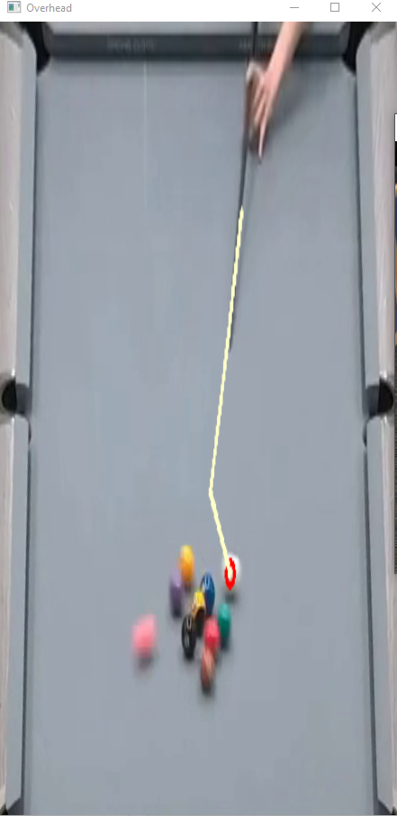
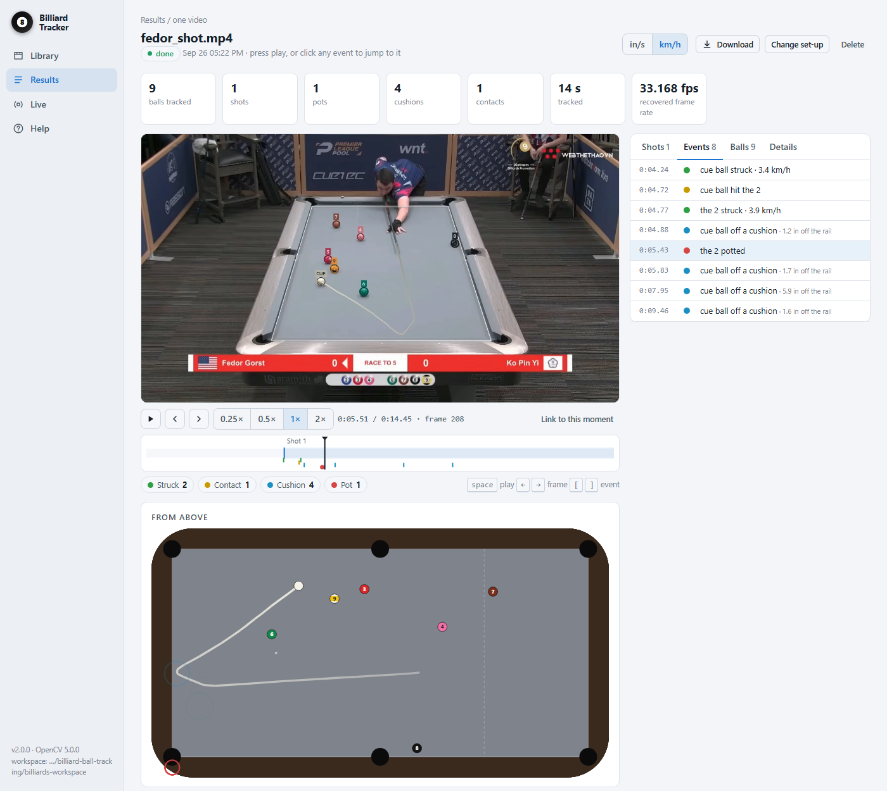
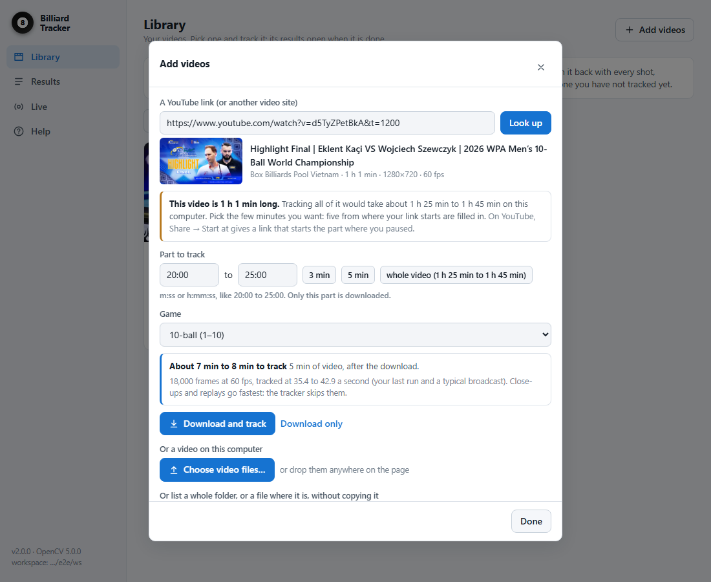

# 🎱 The Story of the Billiard Ball Tracker

*How a class project that followed one ball became a program that follows all
of them, and everything that went wrong along the way.*

> Written 29 Sep 2026. The day-by-day numbers are in [`DIARY.md`](DIARY.md) and
> the long explanations in [`UPGRADE_NOTES.md`](UPGRADE_NOTES.md). This is the
> version to read with a coffee.

---

## Before we start: six words you'll meet

| Word | What it means here |
|---|---|
| **Cloth** | The felt on the table. The program finds the table by finding the cloth. |
| **HSV** | A way to describe a colour: *hue* (which colour), *saturation* (how vivid), *value* (how bright). |
| **Homography** | A formula that turns a spot in the picture into a spot on the table, in inches. It's like flattening a photo of a sheet of paper taken at an angle. |
| **Track / ID** | The program's name for a ball it is following, like `#8`. **Not** the number printed on the ball. |
| **Kalman filter** | A predictor: "the ball was here, moving this fast, so next frame it should be about *there*." |
| **MOTA** | A tracking score. 1.0 is perfect, 0 is as useful as reporting nothing, and below 0 is worse than nothing. |

---

## 🗺️ The whole journey on one screen

| When | Chapter | In one line |
|---|---|---|
| 2015 | [0. The borrowed map](#chapter-0--2015-the-borrowed-map) | Stuart Grieve's code turns a photo of a table into a top-down view |
| May 2024 | [1. One ball, one clip](#chapter-1--may-2024-one-ball-one-clip) | Your ENG 301 project follows the cue ball, after hand-tuning |
| 22 Sep 2026 | [2. Start again](#chapter-2--22-sep-2026-start-again) | A rewrite in one day: every ball, nothing to tune, and a score |
| 23 Sep | [3. Three mysteries](#chapter-3--23-sep-three-mysteries) | A lying clock, floating balls, missing bounces |
| 26 Sep | [4. An app](#chapter-4--26-sep-an-app) | It moves from the terminal into the browser |
| 27 Sep | [5. "Very hard to use"](#chapter-5--27-sep-the-app-is-very-hard-to-use) | The app learns to say what to do next |
| 28 Sep | [6. The real world](#chapter-6--28-sep-the-real-world) | YouTube, 11 venues, camera cuts, answer keys, a small brain |
| 29 Sep | [7. The fine print](#chapter-7--29-sep-the-fine-print) | A ball in a pocket's jaws, the shot log, your two bug reports |

---

## Chapter 0 · 2015: The borrowed map

In 2015 Stuart Grieve wrote a small project called *PoolTable*: "Python code to
identify pool balls on a table from screenshots of matches." When you uploaded
this project on **15 May 2024**, two of its files, `PoolTable.py` and
`Indexer.py`, were the starting point.

They could take a **still photo** of a table, find the cloth, and warp it into a
top-down view. That's all: no video, no balls, no tracking.

*(Their author headers were lost in May 2024 and put back on 23 Sep 2026. See
[`legacy/README.md`](legacy/README.md) for the credit.)*

---

## Chapter 1 · May 2024: One ball, one clip

Your final project for **ENG 301 – Computer Vision** at Fulbright University
Vietnam, finished around midnight on 18–19 May 2024. The whole program was one
170-line `main.py` (kept as [`legacy/main_legacy.py`](legacy/main_legacy.py)).

### How v1 worked

Every frame, it did this:

1. Find the pixels inside a **hand-picked colour box**. For the cue ball:
   `lower_bound = [30, 20, 200]`, `upper_bound = [55, 45, 233]`, give or take 10.
2. Take the **biggest blob** of those pixels. That's "the cue ball".
3. If it's **within 100 pixels** of last frame's position, add it to the trail.
4. If the cue ball and the object ball are **within 20 pixels**, draw a
   "collision" marker.
5. Warp the picture into a top-down view with the 2015 code.




*Left: v1 on `fedor_shot`. The cue ball's path is yellow, the object ball's is
blue, and the contact point is circled. Right: v1's top-down view, which is the
camera picture stretched flat.*

**And it worked,** on the clip it was tuned for.

### The catch

Every one of those numbers made sense for one video only.

- **The colour box** was picked by hand for each ball in each clip
  ([`ball_hsv_values.txt`](legacy/ball_hsv_values.txt) has the cue, blue and
  pink). New lighting, new cloth or a new camera meant picking again. Red balls
  were nearly impossible, because red sits at *both ends* of the hue scale (0
  and 180), so a box around it cuts off half the ball.
- **20 pixels** is about one ball on a tight 480p shot, three balls on a wide
  one, and a third of a ball at 1080p.
- **"The biggest blob"** has no idea which ball is which. Two touching balls
  merge into one blob, and a single missed frame breaks the trail for good.

When the code was reread in 2026, there were a few more surprises:

| Surprise | What happened |
|---|---|
| It opened `kpc-break.mp4` | That file isn't in the repo, so as saved, it couldn't run. |
| `cv2.waitKey(0)` inside the loop | You had to press a key for **every single frame**. |
| Each frame was saved *before* anything was drawn on it | The saved video had no tracking on it… |
| …at the wrong size, at 10 fps | …and it wouldn't open anyway. |

> **What v1 teaches:** it was a recipe that only worked in one kitchen.

---

## Chapter 2 · 22 Sep 2026: Start again

Two years later, on another computer, working with Claude Code: **16 commits
between 04:03 and 16:36.**

### 💡 The big idea: stop measuring in pixels

Instead of asking "which pixels are *this exact colour*?", ask **"what is on the
table that isn't cloth?"** The cloth colour is measured from the video itself,
from 25 frames spread across the clip. That way a player leaning over the table
in a few of them doesn't matter.

Next, find the table's four corners and build the **homography**, the
pixel → inch map. From then on every rule can be written in inches:

- v1: "a collision is closer than **20 pixels**"
- v2: "a collision is closer than **1.25 ball widths**, *and* the balls are
  getting closer"

Inches don't change when the camera zooms. **That one idea is why the program
works on a new video without retuning.**

One detail: a pool table's corners are cut away by the pockets, so "the corner
of the cloth" is in the wrong place. v2 fits a straight line along each cushion
and takes the corner where the lines cross, which is where the corner *would*
be. The corner error went from **22 px to 1.4 px**.

### 🧪 A laboratory that knows the answers

How can you tell it's better? v2 came with a **physics simulator**
([`tools/make_synthetic_clip.py`](tools/make_synthetic_clip.py)). It renders a
break shot where every ball's exact position is known, so the tracker can be
*scored* instead of eyeballed. First score: **MOTA 0.934.**

### 🥊 Then real footage fought back

On the three real clips in the repo (from a 2024 Premier League Pool
broadcast), it broke in ways the simulator had never shown:

| What went wrong | Why | Fix |
|---|---|---|
| The table was read **the wrong way round** | Filmed from behind the end rail, the 100-inch long side looks *shorter* than the 50-inch near side | Keep only the way round that a real camera could have produced |
| Every ball was **split in half** | Balls were sized like flat discs on the cloth, which look squashed from an angle. A sphere looks round from every angle, so the expected size was 40–80% too small | Size balls as spheres |
| 4 ghost balls on every frame | A pocket is dark, round, ball-sized and never moves. To a "not cloth" detector, that's a ball | Leave the pockets out |
| Every striped ball was called **"CUE"** | Stripes and the cue ball are both mostly white | A stripe has one strong band of colour; the cue ball has none |
| The player's hand became balls | Knuckles are round and ball-thick | A real ball's edge has a sharp colour step (23–63 units), a hand's a soft one (5–19). With related fixes: 62 tracks for 8 balls → 10 |
| Balls appeared in the crowd | After a camera cut, the old table map was still being used | Pause when the "table" stops being cloth, then find it again |

And one more: **one frame in three was a copy.** The clips hold 25 fps video
inside a 37.5 fps file. The program measured every copy as if it were new, so a
cue ball rolling smoothly at about 100 in/s was reported at 30, 75, 9, 124 and
160 in/s. The fix was to spot exact copies and skip them.

The same day it also got **2.4× faster** (9.8 → 23.3 fps) without changing a
single digit of its output.

**End of the day:** every ball tracked, no colour settings at all, MOTA 0.936,
76 tests. **Still broken:** most cushion bounces were missed.

---

## Chapter 3 · 23 Sep: Three mysteries

On the work computer: no GitHub, nothing committed. A detective day.

### 🔍 Mystery 1: the speed that wouldn't sit still

Even with the copies skipped, a ball's speed still jittered by about 4 in/s.
The day before, that had been written down as "unfixable". Then the cause
turned up.

The file says 37.5 fps, but each *new* frame is just the next frame of the
25 fps original, so the file's timing says nothing about real time. On top of
that, the screen recorder now and then **missed** a frame, and that step covers
twice the time.

> Picture a flipbook where some pages were photocopied twice and a few were
> torn out. The page numbers tell you nothing about time.

The fix, [`clock.py`](billiards/clock.py), **uses the moving balls as the
clock.** A rolling ball covers a steady distance per real frame, so if it moved
twice as far, two frames passed. Speed error on broadcast-style video went from
**8.8% to 2.2%.**

### 🔍 Mystery 2: the ball that bounced before the cushion

In `fedor_shot`, the cue ball turned round **2.1 inches before** it reached the
near cushion. Balls don't do that.

The answer: a ball's centre is 1.125 inches **above** the cloth.

```
   camera 📷
         \
          \   line of sight
           \
            ●   ← the ball's centre, 1.125 in above the cloth
             \
──────────────✕────────  cloth
              ↑ where the maths put the ball: 2–4 in too far from the camera
```

The fix works out where the camera must be from the table's own shape (about
135 in behind the near rail and 68 in up) and places each ball at its real
height. Now the cue ball turns 0.2 in off the cushion. The simulator was given a
realistic camera at the same time, and without this fix the tracker scored
**MOTA −0.43** on it: worse than reporting nothing.

### 🔍 Mystery 3: the missing bounces

The Kalman filter smooths each path, so it rounds off the sharp corner where a
ball bounces. By the time it notices the turn, the ball is inches away from the
cushion. The fix finds cushions from the **raw** path instead: moving toward a
rail, then away from it. Cushions found in the simulator: **5 → 40 of 44**,
with no false ones.

### Also that day

- `albin_fedor`'s cue ball stopped in a pocket's jaws. The program called it a
  scratch, then brought it back as a brand-new ball, `#10`. Now a lost ball
  waits 1.5 s before it is given up.
- That evening, **ball numbers** arrived ([`balls.py`](billiards/balls.py)).
  They're read from the colours and decided for the whole table at once, since
  there's only one 7. Shot logs could now say "potted the 2".

---

## Chapter 4 · 26 Sep: An app

`python main.py app` opens a page in the browser:

- a **Library** of videos;
- **Set-up**, where you can drag the table's corners if they're wrong;
- tracking that runs in the background;
- **Results**: the video beside a top-down view that follows it frame by frame,
  with a timeline of every event;
- **Live**: a webcam, a stream, or a video replayed as if it were live.



One snag: browsers can't play the video format OpenCV writes, so the app now
writes H.264 (375 frames came to 427 KB).

**The first stress test** ([`tools/robustness.py`](tools/robustness.py)) had
the simulator film the same break 14 ways: green, blue, burgundy, camel and grey
cloth; cameras on a long rail, on the ceiling and on a tripod at a corner;
480p to 1080p; 60 fps. Scores ranged from 0.57 (the corner tripod) to 0.88.

- It even caught a bug in the *scoring*. A pool table is symmetric, so a camera
  on the other side puts corner (0, 0) somewhere else. Three views that tracked
  fine had been scored −0.4 to −0.75.
- On grey cloth, a blue banner was taken for the table.

Pushed to GitHub at the end of the day.

---

## Chapter 5 · 27 Sep: "The app is very hard to use"

Those were your words, and you were right. Each video had four equal buttons,
and the blue one, **Track**, re-ran a video that was already tracked. Your
re-run of `albin_fedor` at 18:55 was exactly that.

The fix was a guide at the top, **① add a video → ② track it → ③ see the
results**, and **one** blue button per video for its next step. The tracker
itself wasn't touched.

---

## Chapter 6 · 28 Sep: The real world

The biggest day. It came in four waves.

### 🌊 1. "Give it a YouTube link"

Your example was the final of the 2026 WPA Men's 10-Ball World Championship:
**61 minutes at 60 fps**. Now you paste a link, pick the minutes you want (say
`20:00` to `25:00`), and see how long tracking will take *before* anything
downloads. Four minutes downloaded in 17 s. The whole hour would take about
**1 h 45 min** to track in the app.



### 🌊 2. "Couldn't track anything"

The first clip from a different tournament, the 2026 US Open, tracked
**nothing**. The program had taken the most common colour in the picture to be
the cloth, and at the US Open that's the **royal-blue floor**. The simulator's
table had always stood on grey carpet, so nothing had warned of this.

The fix tries seven candidates for "the cloth" (colours and greys) and keeps the
one whose outline looks most like a table. A floor fails that test: it runs off
the edge of the picture and wobbles from frame to frame.

Next, one minute from each of **11 venues**: the Mosconi Cup, the UK Open, the
Hanoi Open, heyball, snooker, an old Derby City match, an amateur bar table…
The table was found at all 11.


*This picture is in `results/`, which `tools/venues.py` rewrites, so it's on
your computer but not on GitHub.*

### 🌊 3. 129 balls in one minute

A minute of 9-ball has at most 10 balls. On the Premier League final, the
program counted **129**.

Whenever the table's outline looked different (at every camera cut, and on grey
cloth every 5 seconds or so even without one), the tracker was **thrown away
and rebuilt**, and every ball got a new name tag. Worse, the IDs started again
at 1, so the CSV had different balls under the same number.

The fix is one tracker for the whole video. At a cut, the balls are **set
aside** and imagined rolling on, slowing down and bouncing off cushions, while
the camera is away. When the table comes back, they are **found again**.

There was a twist: the camera across the table sees the table **mirrored**, not
just turned round. The program now tries all four ways of laying the new view
over the old one and keeps the one that puts the balls where they should be. It
also remembers each camera view, and follows a camera that zooms in or pans.

Balls counted: **129 → 33** on the Premier League, 91 → 44 on the Mosconi Cup,
48 → 26 on the UK Open.

> 🐛 *A bug found along the way:* the regular "is the table still where I think
> it is?" check ran on frames 150, 300, 450… On 60 fps broadcasts every one of
> those was a repeated frame, and repeated frames skip the check. **It never
> ran at all.**

### 🌊 4. The plot twist: "the US Open got worse"

That evening, a check said the US Open clip had gone from **25 balls to 66**.
Had the day's work made things worse?

No. The old "25" was really **334 tracks sharing 25 numbers**, because the IDs
restarted at every rebuild. The old count only *looked* better because it was
broken.

> **Counting IDs is not measuring.** You have to know the right answer.

So the project got **answer keys**: four real clips with every ball marked on
keyframes, where it is and which ball it is
([`tools/truth/`](tools/truth/)). They were marked by Claude and helper agents
and checked on overlays; three of the four haven't had a second check.
[`tools/real_eval.py`](tools/real_eval.py) scores any version of the code
against them:

```
score = 1 − (balls missed + phantom balls + extra IDs) / balls
```

Scored against its key, the US Open had actually improved, from **0.35 to
0.83**.

### 🧠 And then, a small brain

Some things rules just couldn't catch: chalk on a rail, knuckles, the shadow in
a pocket. So the project got a **ball model** ([`ballnet.py`](billiards/ballnet.py)),
a small neural network (73,149 numbers, 288 KB). It looks at a 32×32 picture
of every candidate and answers: *Is it a ball? Is it the cue ball? What colour?
Is it a stripe?*

It learned from 24,663 simulated pictures and 16,853 real ones from 14 clips,
each labelled by eye. None came from the answer-key clips, so the test stays
fair. On pictures it had never seen, it kept 98.5% of the balls, threw out 89%
of the non-balls, and got the colour right 95% of the time.

### The day's scoreboard

| Answer key | Morning | Night |
|---|---|---|
| US Open, 3 min | 0 (nothing tracked) | **0.94** |
| Premier League final, 1 min | −0.04 | **0.79** |
| Ceiling camera over a club table (CCTV-style) | 0.22 | **1.00** |
| Tripod, amateur 8-ball (CCTV-style) | −0.29 | **0.74** |

Also that day: `python main.py` with nothing after it now opens the app (before,
PyCharm's Run button just printed the usage). 167 tests.

---

## Chapter 7 · 29 Sep: The fine print

With answer keys, the program can say exactly where it loses points. And today,
you found two things the keys had missed.

### The ball that was there from the start

On the tripod clip, the yellow 1 sat still against the far cushion from the
first frame. It was missed on 12 of 16 keyframes, even though the ball model was
99.999% sure it was a ball. The strip past the far edge could only *continue*
a ball, never *start* one, because a hand on the rail is there too. Now it can
start one when the model is at least 98% sure. Found: **82% → 100%.**

### A number that moved house

When the 9 was potted, its number became free, and the far 1 (which the model
thinks looks a bit striped) took it. Now a potted ball's number stays taken
until a new rack. Balls named wrong on the two CCTV-style clips: 18% → 12% and
12% → 0%.

### The shot log, checked for the first time

On the Premier League minute, only 3 of 8 shots were found. There were three
reasons:

- "Every ball still for 0.4 s means the shot is over" was counted in *file
  frames*. On a broadcast that repeats every other frame, that was really
  0.8 s, longer than the gap between two shots.
- Balls in a rack **tremble** by a pixel or two each frame, which read as
  moving at 5–40 in/s. Now a ball only counts as moving if it actually gets
  somewhere.
- During a **dissolve** between cameras (half a second of two pictures blended
  together), 3–8 still balls seemed to set off at once. One cue stroke moves
  one ball, so that was the picture moving, not the balls.

Now **13 of 13** marked shots are found on three clips, 12 of them with the
right pots.

### 🐛 Your report #1: the 4 hanging in the jaws

In `albin_fedor`'s first shot, the cue ball **jumps** over the 6 to pot the 4,
which was hanging in a corner pocket's jaws. The program never saw the 4.
Remember the ghost balls in Chapter 2? The fix for them blanked out a circle
round every pocket, and the 4 sat 0.54 in from the pocket's centre.

Now, anything inside that circle that isn't cloth and isn't as dark as the hole
is shown to the ball model. Empty pockets score 0.000–0.016; the 4 scored
1.000. For the jump, touching a still ball only counts once that ball moves.

The shot used to read *"hit the 6 first — nothing potted"*. Now it reads
**"potted the 4"**.

### 🐛 Your report #2: the 7 that became the 1

On the US Open, the 7 was called the 1 for 8 seconds, because the model sees a
bit of yellow in it. A ball's number is now "stickier", harder to take away.
Named wrong: 1% → 0%.

### ❌ An idea that didn't work, and that's fine

The model misreads light-blue and dark-blue 2s. The idea was to teach it with
simulated blue 2s. On real footage it got *worse* (Premier League named wrong
0% → 7%), so the change was undone. **A wrong number is worse than no number.**
Those blues need real examples.

Then you watched the US Open result yourself: *"seems good."*

---

## 📊 Then and now

| | v1 (May 2024) | Now (29 Sep 2026) |
|---|---|---|
| Balls followed | the cue ball (and one more, if switched on) | every ball |
| Colour settings per clip | a hand-picked box for each ball | none |
| Pixel thresholds | at least 6 | none: everything is in inches |
| Runs as saved | ❌ (missing video) | ✅ `python main.py` |
| Saved video | ❌ unplayable | ✅ plays in the browser |
| Camera cuts | ❌ | ✅ balls keep their IDs |
| Shots, cushions, pots | a contact marker | a full shot log |
| Ball numbers | ❌ | 87–91% right on broadcasts, none wrong |
| How do we know? | by eye | a simulator, 4 answer keys, 183 tests |
| How you use it | edit the code | an app, the command line, live, YouTube links |

**Today's scores:** US Open **0.95**, Premier League **0.80**, ceiling camera
**1.00**, tripod **0.92**. The simulated break scores MOTA **0.910**, with
speeds within **2.9%**.

## 🚧 Still hard

- **Dissolves** between cameras still leave ghost balls (4 extra shots on the
  Premier League minute).
- **Replays** are tracked as if they were live play.
- **Blue 2s**, light and dark, are misread.
- A **black ball in a pocket's jaws** is as dark as the hole.
- A **side camera** that cuts off both ends of the table isn't tracked.

## 💡 Five lessons from the whole story

1. **Measure in the world's units, not the picture's.** Inches instead of
   pixels is what made the program work on new videos.
2. **Build a test you can't fool:** first a simulator, then answer keys.
3. **A test is only as honest as what it tests.** The simulator's table always
   stood on grey carpet, so a blue floor broke everything.
4. **Counting isn't measuring.** "25 balls" looked better than "66", and was
   worse.
5. **Watch the video.** Your two reports today found things no score had.

---

## 🧩 What each chapter left behind in the code

| File | Born in | Its job |
|---|---|---|
| `billiards/table.py`, `geometry.py` | Ch. 2 | Find the cloth and the table; the pixel → inch map; ball height (Ch. 3) |
| `billiards/detect.py` | Ch. 2 | Find ball-sized things that aren't cloth; balls in pocket jaws (Ch. 7) |
| `billiards/kalman.py`, `track.py`, `assignment.py` | Ch. 2 | Follow each ball and keep its ID; balls set aside at cuts (Ch. 6) |
| `billiards/events.py`, `shots.py` | Ch. 2, 3, 7 | Cushions, collisions, pots, and the shot log |
| `billiards/clock.py` | Ch. 3 | The real time between frames |
| `billiards/balls.py` | Ch. 3 | Which number each ball is |
| `billiards/app/` | Ch. 4–5 | The web app |
| `billiards/fetch.py` | Ch. 6 | YouTube links |
| `billiards/camera.py` | Ch. 6 | Following a camera that moves |
| `billiards/ballnet.py` | Ch. 6 | The small brain |
| `tools/make_synthetic_clip.py`, `evaluate.py` | Ch. 2 | The laboratory |
| `tools/robustness.py` | Ch. 4 | The stress test |
| `tools/venues.py` | Ch. 6 | The 11 venues |
| `tools/real_eval.py`, `tools/truth/` | Ch. 6 | The answer keys |
| `legacy/` | Ch. 0–1 | Where it all began |

## Where to go next

| If you want… | Read |
|---|---|
| How the program works today | [`README.md`](README.md), *How it works* |
| The numbers, day by day | [`DIARY.md`](DIARY.md) |
| Every "why", in depth | [`UPGRADE_NOTES.md`](UPGRADE_NOTES.md) (§2–§17 follow the same order as these chapters) |
| The original 2024 code | [`legacy/`](legacy/) |
